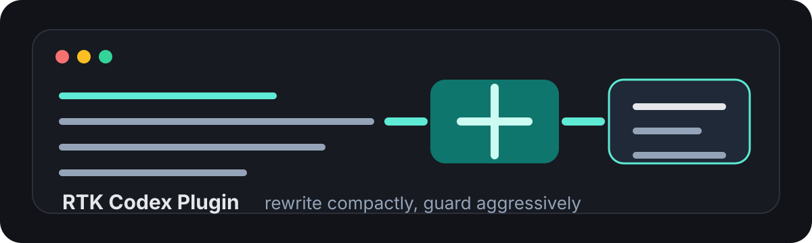

<p align="center">
  
</p>

<h1 align="center">rtk-codex-plugin</h1>

<p align="center">
  <strong>Keep Codex shell output useful before it burns the context window.</strong>
</p>

<p align="center">
  A small Codex-compatible <code>PreToolUse</code> plugin for shell command rewrite and bounded long-line output.
</p>

<p align="center">
  <a href="https://github.com/Krablante/rtk-codex-plugin/actions/workflows/ci.yml">
    
  </a>
  <a href="./LICENSE">
    
  </a>
  
  
</p>

<p align="center">
  <a href="./docs/install.md">Install</a>
  ·
  <a href="./docs/compatibility.md">Compatibility</a>
  ·
  <a href="./docs/stack.md">Stack Fit</a>
</p>

`rtk-codex-plugin` adds a shell-focused `PreToolUse` hook for Codex-compatible
runtimes. It has two jobs:

- route eligible Bash commands through `rtk rewrite` for more compact output;
- wrap risky long-line inspections with a bounded output guard.

The guard is useful even when `rtk` is not installed. Rewrite mode is optional
and activates only when the `rtk` binary is available in `PATH`.

## Why People Use It

- avoid huge JSONL, log, and prompt-capture lines flooding the model context
- keep simple shell exploration compact without changing test or machine output
- preserve exact-output commands such as `rg --files`, `git status --short`,
  JSON modes, counts, lists, test commands, and interactive commands
- install as a small plugin instead of changing every shell command by hand

## Mental Model

| Piece | Role |
| --- | --- |
| Codex-compatible runtime | executes `PreToolUse` hooks before shell calls |
| `rtk-codex-hook` | decides whether a command should be guarded, rewritten, or left alone |
| `rtk-output-guard` | caps per-line and total stdout for risky inspections |
| optional `rtk` binary | rewrites eligible commands into a compact shell form |

Architecture at a glance:

```text
Codex shell tool call
  -> PreToolUse hook
     -> risky JSONL/log/prompt inspection? run through rtk-output-guard
     -> otherwise eligible simple command? ask rtk rewrite
     -> exact-output/test/interactive command? pass through unchanged
```

## Highlights

- bounds known long-line inspection shapes before execution
- works without `rtk` for output guarding
- skips rewrite when exact stdout matters
- uses plain Python scripts and a small plugin manifest
- designed to work standalone and to fit a future Codez + Teledex stack

## Quick Start

Clone the plugin into the plugin cache used by your Codex-compatible runtime.
One common cache layout looks like this:

```bash
codex_home="${CODEX_HOME:-$HOME/.codex}"
git clone https://github.com/Krablante/rtk-codex-plugin \
  "$codex_home/plugins/cache/github/rtk-codex-plugin/local"
```

Enable plugin hooks and the plugin key that matches your install location:

```toml
[features]
plugins = true
plugin_hooks = true

[plugins."rtk-codex-plugin@github"]
enabled = true
```

Run the focused test suite:

```bash
make test
```

Read next:

- [Install](./docs/install.md)
- [Compatibility](./docs/compatibility.md)
- [Stack Fit](./docs/stack.md)

## Notes

- `rtk` rewrite is optional; install `rtk` separately when you want rewrite mode.
- output guarding stays active without `rtk`
- the plugin is intentionally shell-hook-only; gateway/session behavior belongs
  in higher-level tools
